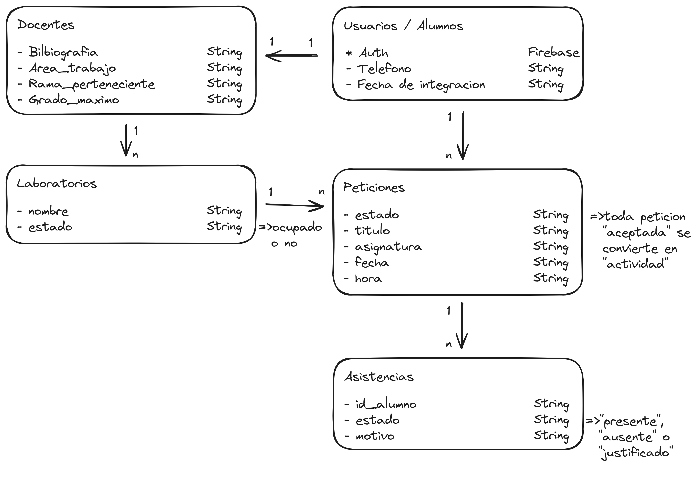

# 🏫 Laboratory Access Control System (LACS)

Un sistema moderno e interactivo para la gestión, reserva y control de acceso a los laboratorios universitarios/académicos, desarrollado en React, TypeScript y Firebase.

---

## 🎯 Propósito del Software

El **Laboratory Access Control System (LACS)** responde a la necesidad de coordinar eficientemente el uso de espacios de laboratorio. Sus principales objetivos son:

* **Gestión de Peticiones y Reservas**: Permitir a docentes y estudiantes solicitar el uso de ambientes de laboratorio para clases de recuperación, exámenes o sesiones de investigación.
* **Control de Disponibilidad en Tiempo Real**: Determinar automáticamente el estado de cada laboratorio (*Libre* / *Ocupado*) según la fecha, hora actual y las peticiones aprobadas.
* **Aprobación de Solicitudes**: Otorgar a los supervisores/encargados de laboratorio el control para aceptar o rechazar solicitudes de ambiente.
* **Registro de Asistencia y Justificaciones**: Llevar el seguimiento de asistencia de los participantes en cada sesión reservada, junto con el motivo en caso de inasistencias.
* **Estadísticas y Reportes**: Visualizar información cuantitativa sobre el uso de ambientes e indicadores clave.
* **Soporte Multilingüe**: Interfaz adaptable con soporte para múltiples idiomas (Español e Inglés).

---

## 🛠️ Herramientas y Tecnologías Usadas

| Categoría | Tecnología / Librería | Descripción |
| :--- | :--- | :--- |
| **Gestor de Paquetes** | [pnpm](https://pnpm.io/) *(Recomendado)* / npm / Bun / Yarn | Gestión eficiente y rápida de dependencias. |
| **Frontend Core** | [React 18](https://react.dev/) + [TypeScript](https://www.typescriptlang.org/) | Biblioteca de UI con tipado estático estricto. |
| **Build Tool** | [Vite](https://vitejs.dev/) (`@vitejs/plugin-react-swc`) | Entorno de desarrollo rápido y empaquetado optimizado con SWC. |
| **Estado Global** | [Redux Toolkit](https://redux-toolkit.js.org/) | Gestión centralizada de estados y lógica asíncrona (*slices* y *thunks*). |
| **Enrutamiento** | [Wouter](https://github.com/molefrog/wouter) | Enrutador liviano y flexible para React. |
| **Backend & DB** | [Firebase](https://firebase.google.com/) | Firebase Authentication para sesiones y Firestore para base de datos NoSQL. |
| **Estilos** | Vanilla CSS | Estilos CSS personalizados por componente y página. |
| **Testing** | [Vitest](https://vitest.dev/) + Testing Library | Pruebas unitarias y de integración con entorno Happy DOM. |
| **Linter** | [ESLint](https://eslint.org/) | Calidad y estándares de código para TypeScript y React. |

---

## 🏗️ Arquitectura del Proyecto

El proyecto implementa una **Arquitectura Modular basada en Características (Feature-based Architecture)**:

```text
Lab-Acces-Control-System/
├── public/                # Recursos estáticos públicos
├── src/
│   ├── assets/            # Imágenes e íconos compartidos
│   ├── auth/              # Módulo de Autenticación
│   │   ├── components/    # Componentes de login/registro
│   │   ├── hooks/         # Custom hooks (useCheckAuth, useForm)
│   │   └── pages/         # Páginas de inicio de sesión
│   ├── firebase/          # Configuración e integración con Firebase
│   │   ├── config.ts      # Inicialización del SDK de Firebase
│   │   └── providers.ts   # Proveedores de autenticación (Email, Google)
│   ├── laboratories/      # Módulo Principal de Laboratorios
│   │   ├── components/    # Componentes UI (NavBar, Modales, Calendario, etc.)
│   │   ├── context/       # Proveedor de contexto global (LanguageContext)
│   │   ├── helpers/       # Utilidades puras (fechas, días, semanas, traducciones)
│   │   ├── hooks/         # Custom hooks para fechas y calendarios
│   │   ├── pages/         # Páginas (Home, Schedule, Petitions, Estadistic, Perfil)
│   │   └── routes/        # Rutas internas del sistema de laboratorios (LabRoutes)
│   ├── router/            # Enrutador principal de la aplicación (AppRouter)
│   ├── store/             # Configuración del store global con Redux Toolkit
│   ├── styles.css         # Estilos globales
│   ├── main.tsx           # Punto de entrada principal
│   └── LacsApp.tsx        # Componente raíz
```

---

## 🗄️ Organización de la Base de Datos

La persistencia de datos se gestiona mediante **Firebase Firestore** (Base de Datos NoSQL basada en documentos y colecciones).



### Colecciones Principales y Esquema

1. **`users` (Usuarios)**
   * Contiene los perfiles de los usuarios del sistema (Estudiantes, Docentes Investigadores, Administradores/Supervisores).
   * Campos principales: `uid`, `displayName`, `email`, `role`, `photoURL`.

2. **`laboratorios` (Laboratorios)**
   * Representa los ambientes físicos (ej. Lab. Software, Lab. Redes I y II, Lab. Ciberseguridad, Lab. Estadística).
   * Estado dinámico: **`busy`** (Ocupado) o **`free`** (Libre) evaluado automáticamente según el rango horario de las reservas aceptadas en la fecha actual.

3. **`petitions` / `peticiones` (Solicitudes de Ambiente)**
   * Registro de reservas generadas por estudiantes o docentes.
   * Campos principales: `id_petition`, `id_student`/`id_docente`, `id_laboratory`, `date`, `time_range`, `status` (`pending` \| `accepted` \| `rejected`).

4. **`attendances` (Asistencias)**
   * Subcolección o arreglo estructurado dentro de cada petición reservada para controlar el ingreso de los estudiantes.
   * Estructura del objeto de asistencia:
     ```json
     [
       {
         "id_student": "5as74hf5jf7ac1ax26h5g8",
         "state": "absent",
         "reason": "Justificación de inasistencia médica"
       }
     ]
     ```

---

## 🚀 Pasos para Ejecutarlo Localmente

Sigue estos pasos para instalar y ejecutar el proyecto en tu entorno local:

### 1. Requisitos Previos

Asegúrate de tener instalado:
* **Node.js** (v18.0.0 o superior)
* **pnpm** *(Recomendado)*: `npm install -g pnpm`
* Alternativamente: **npm**, **Bun** o **Yarn**

### 2. Clonar el Repositorio

```bash
git clone https://github.com/tu-usuario/Lab-Acces-Control-System.git
cd Lab-Acces-Control-System
```

### 3. Instalar Dependencias

Con **pnpm** *(Recomendado)*:
```bash
pnpm install
```

Otras alternativas:
```bash
npm install
# o con Bun
bun install
# o con Yarn
yarn install
```

### 4. Configuración de Firebase (Opcional / Desarrollo)

Verifica que el archivo `src/firebase/config.ts` contenga las credenciales válidas de tu proyecto de Firebase.

### 5. Iniciar el Servidor de Desarrollo

```bash
pnpm run dev
# o npm run dev
```

Abre tu navegador e ingresa a: `http://localhost:5173`

---

## 📜 Comandos Disponibles

*(Ejemplo usando `pnpm`, también puedes usar `npm`, `bun` o `yarn`)*

* `pnpm run dev`: Inicia el servidor de desarrollo local con Vite.
* `pnpm run build`: Compila el proyecto para producción.
* `pnpm run preview`: Previsualiza la build de producción localmente.
* `pnpm run test`: Ejecuta la suite de pruebas unitarias con Vitest.
* `pnpm run lint`: Realiza el análisis estático de código con ESLint.
